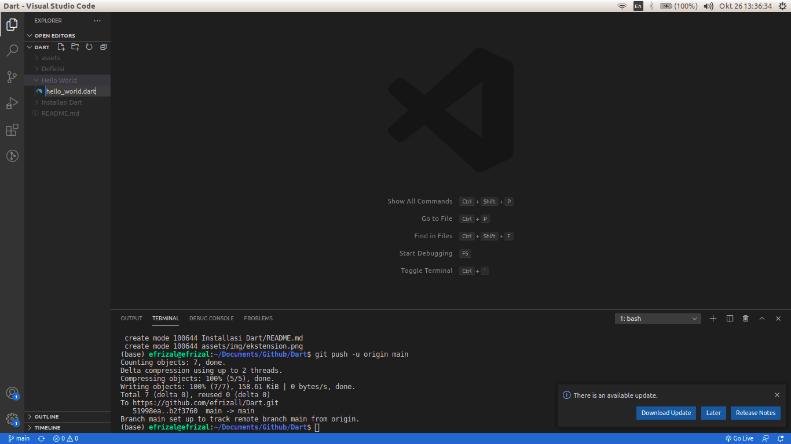
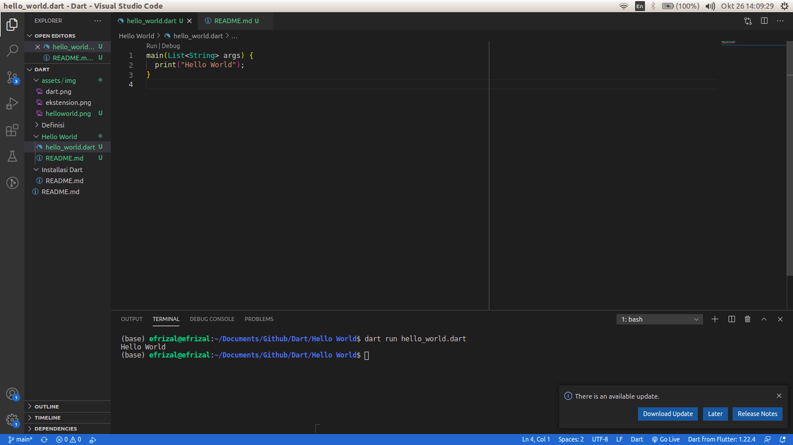
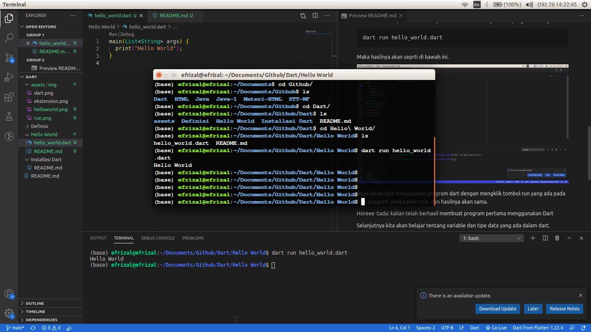

# Program Pertama
Sepertinya kurang Afdhal jika kita mempelajari sebuah bahasa pemrograman jika kita belum mencetak tulisan _Hello World_. Maka dari itu untuk program pertama yang akan kita buat yaitu mencetak tulisan _Hello World_ pada console.

Yuk langsung aja kita buat. :grin:

1. Yang pertama siapkan folder khusus untuk menyimpan semua source code untuk kita belajar, kalian dapat meletakkan folder tersebut di tempat mana saja dan menamai dengan nama apa saja. Kalau saya akan menamai foldernya dengan nama Dart

2. Kemudian silahkan kalian buka code editor yang sudah kalian install sebelumnya.

3. Selanjutnya buat file baru dan berinama "hello_world.dart". Kemudian kalian save file tersebut di dalam folder yang sudah kalian siapkan tadi.



4. Di dalam file tersebut kita akan isi dengan program seperti ini.
```
main(List<String> args) {
  print("Hello World");
}
```

Kemudian kalian save atau **ctrl + s**

Jangan pusing dulu ya.. :grin:

5. Selanjutkan kita jalankan program yang sudah kita buat tadi, caranya kita buka terminal terlebih dahulu

    ( Jika kalian menggunakan **VS Code**, kalian tinggal buka melalui menu yang ada di atas layar, Terminal -> New Terminal ).

    Jika kalian bukan menggunakan **VS Code** seilahkan buka terminal anda, kemudian arahkan atau masuk kedalam folder tempat kalian menyimpan file dart tadi.

    Jika sudah, kalian ketikkan perintah ini untuk menjalankan program dartnya.

```
dart run hello_world.dart
```

Maka hasilnya akan seprti di bawah ini.

## Jika dijalankan langsung di VS Code


## Ini jika kita jalankan menggunakan terminal


Atau kalian bisa menjalankan program dart dengan mengklik tombol run yang ada pada atas program yang kalian tulis, dan hasilnya akan sama.

Horeee :tada: kalian telah berhasil membuat program pertama menggunakan Dart

Selanjutnya kita akan belajar tentang variable dan tipe data yang ada dalam dart.