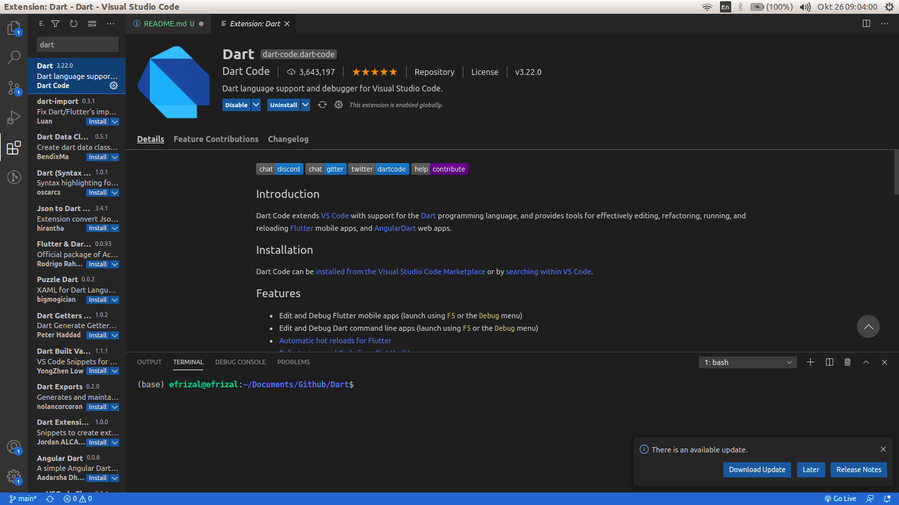

# Peralatan Bertempur
Ada dua peralatan yang akan kita gunakan untuk belajar Dart
1. **Teks editor**, kalian dapat teks editor apa saja yang kalian senangi, tetapi di sini saya akan menggunakan **VS Code**. Jangan lupa kita juga akan install ekstensi Dart-nya.



2. **Dart SDK**, (berisi library, compiler, transpiler, dll. yang dibutuhkan untuk coding Dart.


# Installasi Dart
Pada latihan ini saya menggunakan sistem operasi Ubuntu 16.04 untuk instalasinya. Pada kali ini saya install menggunakan **apt-get**

Buka terminal kalian, kemudian copy dan paste perintah dibawah ini satu persatu.
```
sudo apt-get update
```

```
sudo apt-get install apt-transport-https
```

```
sudo sh -c 'wget -qO- https://dl-ssl.google.com/linux/linux_signing_key.pub | apt-key add -'
```

```
sudo sh -c 'wget -qO- https://storage.googleapis.com/download.dartlang.org/linux/debian/dart_stable.list > /etc/apt/sources.list.d/dart_stable.list'
```

Kemudian install Dart SDK nya.
```
sudo apt-get update
```

```
sudo apt-get install dart
```

Jika ingin mengetahui versi dari Dart yang terinstall, kalian dapat mengetikkan perintah.
```
dart --version
```

Mudah bukan cara menginstall-nya :grin: